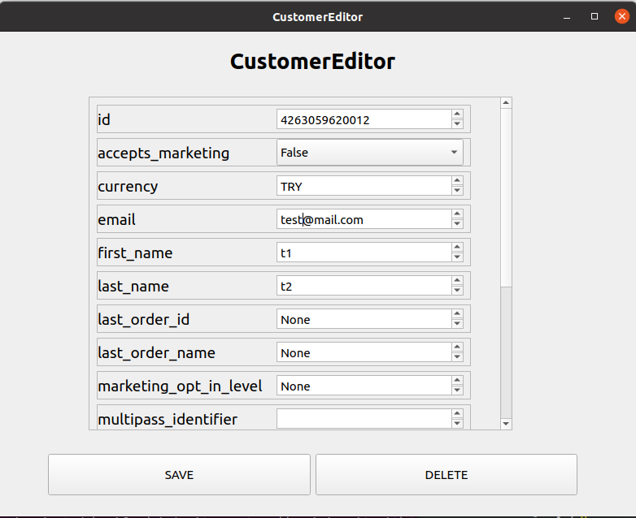

# Shopify Admin
A PyQt5 interface for managing Shopify stores.

This is an incomplete freelance project I started to which I could never find time to finish. Despite that, with a bit of tinkering it works fine.

The codebase is a bit of mess because the features were not planned ahead and I did not have good python threading knowledge at the time of writing. Other than that, I think the code is in a good state.

Install with

`pip3 install -r requirements.txt`

Run with 

`python3 mywindow.py`

## Images

## Features
- Editor and viewers for many of the Shopify tables.
- Bulk editing
- CSV exporting tables
- Storing multiple store credentials
- Double clicking on the top-left corner of the table viewer to select all items
- Page by page viewing table entries
- On demand loading of tables

## Planned Features
- Bulk editing multiple store
- Uploading images (Implemented but not working)
- Fixing or adding debug log to many crashes (sorry for that)

## Used Technologies
- Python Shopify Admin API
- PyQt5
- Sqlite3 for storing store credentials
- Python csv and threading modules

